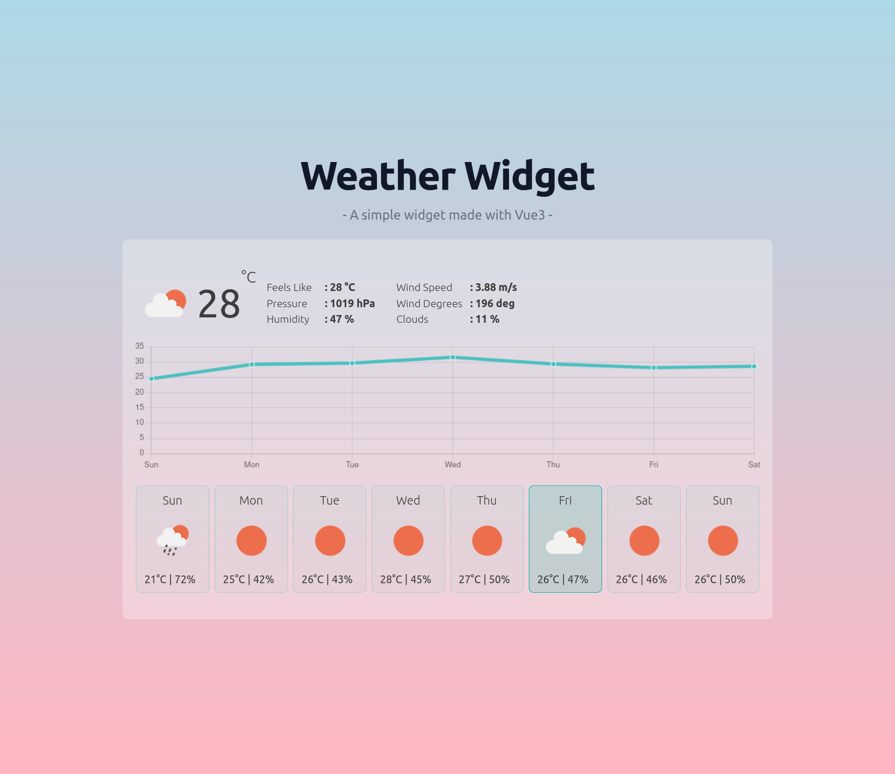

# Weather Widget
A simple weather widget in Vue3 using OpenWeatherMap,

# Overview
---
# Demo
---

# Installation
---
# API Documentation
API Documentation: https://openweathermap.org/api/one-call-api.

# Licence
Licence of this project is Apache License Version 2.0,
# Contact Information
For any questions contact me at vtzivaras[at]gmail.com
